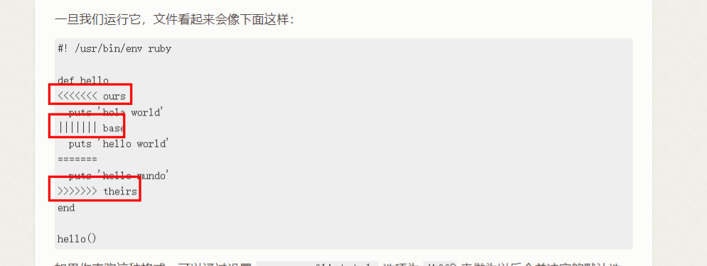
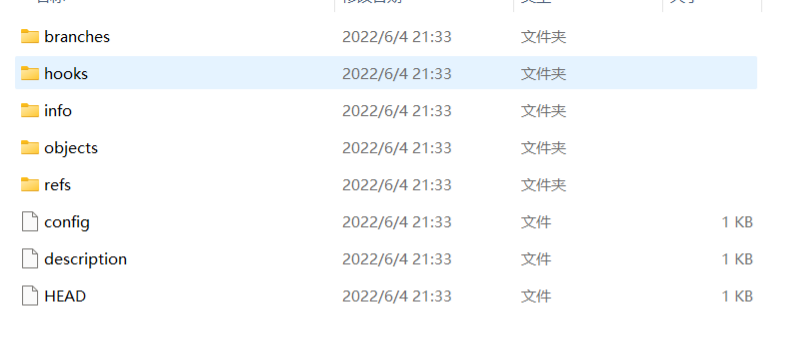
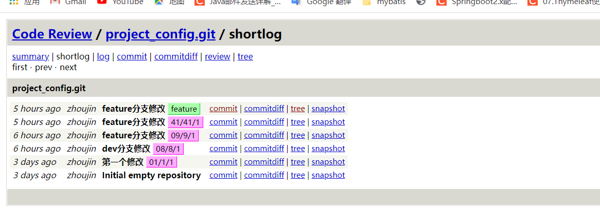
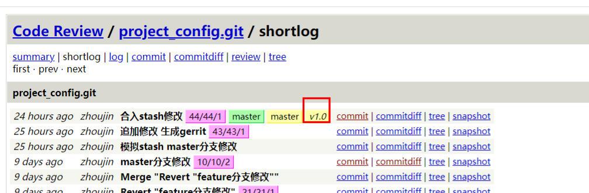
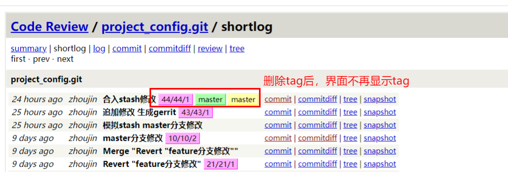

### git 学习

#### 概念

版本控制(VCS)：记录文件内容变化，以便将来查阅指定修改的系统

发展阶段

​	1.本地版本控制

​	2.集中化版本控制 CVS  SVN  Perforce:可以多人协作，完全依赖中央仓库，服务器宕机，导致所有人都无法工作

​	3.分布式版本控制系统：GIT Mercurial、Bazaar 以及 Darcs  每次克隆中央仓库代码，相当于对仓库代码的完整备份，方便恢复，不依赖网络


#### git是什么

git与其他控制系统的差异

其他系统：基于差异的版本控制

> Git 不按照以上方式对待或保存数据。反之，Git 更像是把数据看作是对小型文件系统的一系列快照。 在 Git 中，每当你提交更新或保存项目状态时，它基本上就会对当时的全部文件创建一个快照并保存这个快照的索引。 为了效率，如果文件没有修改，Git 不再重新存储该文件，而是只保留一个链接指向之前存储的文件。 Git 对待数据更像是一个 **快照流**。

git 几乎所有操作都是本地执行

保证完整性

> Git 中所有的数据在存储前都计算校验和，然后以校验和来引用

三种状态 --对应三个目录  工作区  暂存区  本地仓库

> 已提交--commited:数据已经保存到本地仓库中了
>
> 已修改--modified:文件修改，但是没有保存到数据库中
>
> 已暂存--staged:对已修改文件的当前版本做了标记，使之包含在下次提交的快照中


软件安装-略

##### 软件配置

git的配置文件存在三个位置

​	1./etc/gitconfig  没找到

​	2.~/.config/jgit/config

​	3.~/.gitconfig文件

##### 查看git所有配置

```shell
[root@ ~]# git config --list

#显示最后生效的配置名及配置文件
[root@ ~]# git config --list --show-origin
file:/root/.gitconfig	user.email=@123.com
file:/root/.gitconfig	user.name=
```

设置git参数

```shell
git config --global 参数名 参数值
```

##### 查看帮助

`git help command`等价于

`git command --help`

只需要查看参数`git command -h`

##### 

##### 初始化

`git init` 或者`git clone 远程仓库`

git中的文件状态

已跟踪：被纳入了版本控制的文件，在上一次快照中有该文件的记录，在工作一段时间后，文件可能师已修改，未修改，或者已放入暂存区，是git已知的文件，初次克隆某个仓库的时候，所有文件都是未修改的已跟踪文件

未跟踪：除已跟踪文件外的都是未跟踪文件，在上一次快照中没有文件记录

新增的文件会被git定义为未跟踪文件

```shell
[root@ demo]# touch README
[root@ demo]# git status
On branch master

Initial commit

Untracked files:
  (use "git add <file>..." to include in what will be committed)

	README

nothing added to commit but untracked files present (use "git add" to track)
```

跟踪新文件

git add   文件名/目录路径

作用：将未跟踪的文件添加到暂存区，并标记为已跟踪文件；将已修改的已跟踪文件添加到暂存区中

```shell
[root@ demo]# touch file
[root@ demo]# echo "hello" >README 
[root@ demo]# git status
On branch master

Initial commit

Changes to be committed:
  (use "git rm --cached <file>..." to unstage)

	new file:   README

Changes not staged for commit:
  (use "git add <file>..." to update what will be committed)
  (use "git checkout -- <file>..." to discard changes in working directory)

	modified:   README

Untracked files:
  (use "git add <file>..." to include in what will be committed)

	file
```

同一个文件可能同时出现在暂存区与非暂存区

查看简要的文件状态 `git status -s`或者 `git status --short`

```shell
[root@ demo]# git status -s
AM README
?? file
# ?? 新添加的未跟踪文件
# A 新添加到暂存区的文件
# M 修改过的文件
```

##### 忽略文件

在主目录下创建.gitignore文件

格式规范

> `.gitignore` 的格式规范如下：
>
> - 所有空行或者以 `#` 开头的行都会被 Git 忽略。
> - 可以使用标准的 glob 模式匹配，它会递归地应用在整个工作区中。 glob ：shell所使用的简化的正则表达式
> - 匹配模式可以以（`/`）开头防止递归。
> - 匹配模式可以以（`/`）结尾指定目录。
> - 要忽略指定模式以外的文件或目录，可以在模式前加上叹号（`!`）取反。

每个目录都可以有自己的.gitignore文件

##### 比较修改

`git diff` :比较工作目录中当前文件和暂存区域快照的差异，也就是和最近一次加入到暂存区后的内容对比

新增的文件需要add 后 使用 `git diff --staged` 查看差异

`git diff --staged` 或者`git diff --cached` :对比已暂存文件与最后一次提交的文件差异

> git diff 本身只显示尚未暂存的改动，而不是自上次提交以来所做的所有改动。 所以有时候你一下子暂存了所有更新过的文件，运行 `git diff` 后却什么也没有，就是这个原因。

##### 提交记录

`git commit -m 'msg'`:提交修改

每次提交的都是暂存区的快照内容，未被暂存的文件将不会被提交

`git commit -a`：提交所有修改，只要文件已被跟踪，都会包含，不需要使用`git add`命令

##### 移除文件

`git rm` :不是单纯的删除文件，而是将文件移除暂存区，文件也会在本地工作目录删除，后续也不会出现在未跟踪文件中，然后直接提交文件就会被删除了

```shell
[root@ demo]# git rm file 
rm 'file'
[root@ demo]# git status
On branch master
Changes to be committed:
  (use "git reset HEAD <file>..." to unstage)

	deleted:    file

[root@ demo]# ls
README
[root@ demo]# git status -s
D  file
```

可以使用`git reset HEAD file` 将文件移出暂存区，但仍是已跟踪文件

如果直接使用`rm file`命令，则需要执行`git add .` 将修改添加到暂存区，然后提交删除

把文件保留在硬盘本地，但是不继续跟踪，使用`git rm --cached`命令

```shell
[root@ demo]# git rm --cached file 
rm 'file'
[root@ demo]# ls
file  README
[root@ demo]# git status
On branch master
Changes to be committed:
  (use "git reset HEAD <file>..." to unstage)

	deleted:    file

Untracked files:
  (use "git add <file>..." to include in what will be committed)

	file
```

`git rm` ：也可以使用正则表达式，其中`*`需要转义成`\*`

##### 移动文件

`git mv` :重命名文件，会直接将文件添加到暂存区

相当于执行了三条命令

`mv file file2`

`git rm file`

`git add file2`


```shell
[root@ demo]# git mv file file2
[root@ demo]# ls
file2  README
[root@ demo]# git status
On branch master
Changes to be committed:
  (use "git reset HEAD <file>..." to unstage)

	renamed:    file -> file2
```


##### 查看历史上库记录

`git log`：在不传参的情况下，按时间顺序列出所有提交

常用参数

> -p :列出每次提交的差异，后面可以接 -数字 限定显示的条数
>
> --stat 打印每次提交信息的总结
>
> -数字 ：显示对应条数的提交，比如最近一次的提交`git log -1`
>
> --pretty=oneline :只显示第一行内容，即只包含commit和commit id
>
> --pretty=format 来格式化打印提交信息，包括提交日期，父提交的hash 当前提交的hash 作者，提交msg等信息 format可以省略
>
> --graph :用来显示分支，合并历史，可以搭配oneline format使用
>
> --no-merges ：显示内容不包括合并提交

```shell
[root@ demo]# git log --stat
commit 55fd1c4633ddea2c5e6f7eef591cacafaa30a2be
Author:  <@123.com>
Date:   Tue Mar 22 20:32:03 2022 +0800

    第二次提交

 file  | 1 -
 file2 | 1 +
 2 files changed, 1 insertion(+), 1 deletion(-)

commit 57187cb2010fbdd418ab157c4c2b3661e82a5568
Author:  <@123.com>
Date:   Mon Mar 21 22:06:48 2022 +0800

    第一次提交

 README | 1 +
 file   | 1 +
 2 files changed, 2 insertions(+)

[root@ demo]# git log --pretty=oneline
55fd1c4633ddea2c5e6f7eef591cacafaa30a2be 第二次提交
57187cb2010fbdd418ab157c4c2b3661e82a5568 第一次提交
```

限制`git log`的输出内容

常用参数

> --since 或者--after :指定时间之后的提交
>
> --until 或者 --before :指定时间之前的提交
>
> --author
>
> --commiter
>
> --grep
>
> -S 字符串 ：只输出添加或者删除字符串的修改记录
>
> 直接加文件名或者目录名，只输出对目录或者文件的提交修改 一般放在参数最后面  用--   -- file  -- dir/  ==注意有空格==


```shell
[root@ demo]# git log --since 2.day
[root@ demo]# git log -S hello
```

commit-id 是用SHA1计算出来的一个16进制数

精简查看日志

```shell
[root@ day01]# git log  --pretty=oneline file 
a212e5c26b8d7ae5f098fc23a18a22feb4077404 xiugai
3b766e23e936aaf8288080fdc99b5bfc6515fefd 第一个修改
```

##### 撤销操作

`git commit --amend` 追加修改，可以继续修改文件或者提交时的msg

> tips:当你在修补最后的提交时，与其说是修复旧提交，倒不如说是完全用一个 **新的提交** 替换旧的提交， 理解这一点非常重要。从效果上来说，就像是旧有的提交从未存在过一样，它并不会出现在仓库的历史中。

```shell
[root@ demo]# git log -- day0322
commit 73c581745399ab87d254a59e0c6e88f50142b070
Author:  <@123.com>
Date:   Tue Mar 22 21:41:43 2022 +0800

    0322第二次修改，修改了commit msg
[root@ demo]# git commit --amend
[master b1a2b14] 0322第三次修改，查看commit id是否变化
 Date: Tue Mar 22 21:41:43 2022 +0800
 1 file changed, 1 insertion(+)
 create mode 100644 day0322
[root@ demo]# git log -- day0322 
commit b1a2b14cb9248bb04e08982d6cf1a75ec9ad8e74
Author:  <@123.com>
Date:   Tue Mar 22 21:41:43 2022 +0800

    0322第三次修改，查看commit id是否变化

# 经过测试 commit id 发生了变化，旧的commit id 已经不存在了
```

取消暂存的文件 通过`git status`命令可以得到提示

`git reset HEAD filename`：将加入到暂存区的文件移出，此方法比较危险

取消本地工作目录对文件的修改 通过`git status`命令可以得到提示

`git checkout -- file`：撤销本地修改 也是一个危险命令，如果想要保留修改但是又不能加入版本控制，在分支处可以保存进度

在`git`中，几乎所有已提交的记录都是可以恢复的


##### 远程仓库的使用

`git remote`：得到远程服务器的简写，一般为origin

```shell
[root@ project_config]# git remote
origin
[root@ project_config]# git remote -v
origin	ssh://@121.41.176.117:29418/project_config (fetch)
origin	ssh://@121.41.176.117:29418/project_config (push)
```

`git clone`  命令会自行添加远程仓库

自己添加远程仓库，并指定名称

`git remote add 远程仓库别名 远程仓库`

用Gerrit演示失败了，gerrit仓库没有.git

解决，先执行`git init`

```shell
[root@ remote_demo2]# git init
Initialized empty Git repository in /home/gerrit/git/remote_demo2/.git/
[root@ remote_demo2]# git remote add remotezj ssh://@121.41.176.117:29418/project_config
[root@ remote_demo2]# git remote -v
remotezj	ssh://@121.41.176.117:29418/project_config (fetch)
remotezj	ssh://@121.41.176.117:29418/project_config (push)
```

拉取仓库信息`git fetch remotezj`：本地仓库没有变化，会拉取所有分支信息

`git checkout master` 切换到master分支后，会出现master分支内容，但是使用`git pull`出现报错

查询后，需要指定`git pull`时的分支，即要运行`git pull remotezj master` 才可以 

查看远程仓库详细信息

```shell
[root@ remote_demo2]# git remote show remotezj
* remote remotezj
  Fetch URL: ssh://@121.41.176.117:29418/project_config
  Push  URL: ssh://@121.41.176.117:29418/project_config
  HEAD branch: master
  Remote branches:
    bug     tracked
    feature tracked
    master  tracked
    other   tracked
```

远程仓库的重命名与删除

`git remote rename remotezj zj`

`git remote remove zj` :删除后，就与远程仓库没有关联了

```shell
[root@ remote_demo2]# git remote -v
remotezj	ssh://@121.41.176.117:29418/project_config (fetch)
remotezj	ssh://@121.41.176.117:29418/project_config (push)
[root@ remote_demo2]# git remote rename remotezj zj
[root@ remote_demo2]# git remote -v
zj	ssh://@121.41.176.117:29418/project_config (fetch)
zj	ssh://@121.41.176.117:29418/project_config (push)
[root@ remote_demo2]# git remote remove zj
[root@ remote_demo2]# git remote -v
```


##### 打tag

==Git 可以给仓库历史中的某一个提交打上标签，以示重要==

`git tag` 或者`git tag -l` 列出标签

也可以按照匹配模式查找

`git tag -l 'a.*'`

创建标签：git支持两种方式，1.轻量标签 2.附注标签（信息更完整，更常用）

```shell
# -a 代表创建附注标签，不加-a 则默认创建轻量标签
[root@ project_config]# git tag -a "v3.23.1" -m "0323第一个标签"
[root@ project_config]# git tag -l 
master
v3.23.1

# 给指定的某个历史提交来打标签
#创建tag并推送到远程仓库
[root@ project_config]# git commit -m "0323第一次提交"
[master f46893b] 0323第一次提交
 1 file changed, 1 insertion(+)
 create mode 100644 day04/file
[root@ project_config]# git push origin v3.23.2
# 一次推送全部标签 使用--tags参数
# 删除本地tag与远程tag,如果远程tag与分支名一样，会导致无法push代码
[root@ project_config]# git tag -d master
Deleted tag 'master' (was c11017b)

[root@ project_config]# git push origin :refs/tags/master
remote: Processing changes: refs: 1, done    
To ssh://121.41.176.117:29418/project_config
 - [deleted]         master
# 第二种删除远程标签的方式
git push origin --delete tagname
```

`git show v3.23.1` 查看标签详细信息，输出显示了打标签者的信息、打标签的日期时间、附注信息，然后显示具体的提交信息。

==注意：如果本地修改没有推送到远程仓库，是可以将这次修改打上标签并推送到远程仓库，但是只是推送了tag，修改内容还是不会在远程仓库体现，需要手动再push提交修改到远程仓库==

检出标签 `git checkout tagname ` 

这样会使得仓库处于==分离头指针== 状态，会有不好的影响，关于分离头指针的介绍https://zhuanlan.zhihu.com/p/158635615

简单来说，就是head指向了某个commit 而不是分支，会导致后续无法修改，head也不会移动到最新的提交，解决办法是新建一个分支，然后合并即可

##### 给git命令定义别名 alias

`git config --global aias.co checkout` :运行git co 就相相当于`git checkout`


#### Git分支模型

Git 的分支，其实本质上仅仅是指向提交对象的可变指针。

每次提交后，HEAD都会指向分支最新的提交

HEAD:在 Git 中，它是一个指针，指向当前所在的本地分支（译注：将 `HEAD` 想象为当前分支的别名）。

##### 创建分支

`git branch name`：已当前HEAD指向创建分支，但不会切换到该分支

`git checkout -b name`：创建并切换到分支

`git checkout name`：切换分支

查看仓库所有分支HEAD指向 ,可以看出新建的分支与当前master分支HEAD一致，指向同一个提交对象

```shell
[root@ project_config]# git branch dev
[root@ project_config]# git log --oneline --decorate
f46893b (HEAD -> master, tag: v3.23.2, origin/master, origin/HEAD, dev) 0323第一次提交
c11017b (tag: v3.23.1) 合入stash修改
4aa9c76 追加修改 生成gerrit
....

```

HEAD会随当前分支提交，自动向前移动，不会影响其他分支，切换到其他分支后，又会恢复到之前最新的提交

当你切换分支的时候，Git 会重置你的工作目录，使其看起来像回到了你在那个分支上最后一次提交的样子。


 创建一个新分支就相当于往一个文件中写入 41 个字节（40 个字符和 1 个换行符）

```shell
# 查看分支的所有记录，包括合并
[root@ project_config]# git log --oneline --decorate --graph --all
```

##### 合并分支

> 1.在新分支上提交内容
>
> 2.切换到原始分支，并合并刚才的新分支
>
> ```shell
> [root@ project_config]# git merge dev
> Updating f46893b..9845b3f
> Fast-forward
>  day05/file | 1 +
>  1 file changed, 1 insertion(+)
>  create mode 100644 day05/file
> ```
>
> `git merge ` 默认使用fast-forward模式来合并分支，换句话说，当你试图合并两个分支时， 如果顺着一个分支走下去能够到达另一个分支，那么 Git 在合并两者的时候， 只会简单的将指针向前推进（指针右移），因为这种情况下的合并操作没有需要解决的分歧——这就叫做 “快进（fast-forward）”。也就是不会产生冲突
>
> 3.删除旧的分支dev `git branch -d dev`
>
> 4.如果之前拉了两条临时分支，在合并第一条临时分支后，再次合并第二次临时分支，`git merge`方式会变为recursive 模式
>
> merge分支出现冲突
>
> ```
> <<<<<<< HEAD
> hello dev1
> =======
> hello world
> hello dev2
> >>>>>>> dev2
> ```
>
> <<<head 指的是当前分支的内容
>
> ====分割线代表的是被合并分支的提交内容，这种正常时只能保留一种，也可以修改修改后`git add. && git commit`提交，也可以放弃这次合并`git merge --abort`
>
> 可以使用合并工具来通过图形化界面merge  `git mergetool`


##### 分支管理

`git branch -v` :查看当前所有本地分支的最新一个提交

分支前面的*号代表当前仓库所处的分支

```shell
[root@ project_config]# git branch -v
  dev1   87e4eae dev1分支第一次提交
  dev2   2579431 dev2第一次提交
* master a8889e6 [ahead 4] 修复冲突
```

`git branch --merged` ：查看已经合并到当前分支的其他分支，如果分支被删除，则不会显示出来。对应未合并内容的分支`git branch --no-merged`

对于未合并的分支，删除该分支时,git会阻止，可以使用`git branch -D name` 强制删除


长期分支：一般在工作指master分支，或者一些Dev分支等

主题分支：主题分支对任何规模的项目都适用。 主题分支是一种短期分支，它被用来实现单一特性或其相关工作。


##### 分支策略

##### 远程分支--remote

remote可以是远程仓库连接，也可以是clone时的名字（origin）或者自己取的名字

远程引用是对远程仓库的引用（指针），包括分支、标签等等

`git ls-remote 远程仓库连接或名字`：查看所有远程引用

`git remote show origin` ：查看远程分支详细信息

在git中，**origin**代表远程仓库的连接，用来替代远程仓库，所以工作时可以有两条分支，本地分支`master`与远程分支`origin/master`


`git fetch remote`：同步远程仓库数据到代码库，但是本地目录不会发生变化

在git中，可以添加多个远程仓库，使用`git remote add 远程仓库链接` 来添加

`git push remote branch`：推动本地分支代码到远程分支，如果两个分支名不一样，也可以推送，使用`git push origin 本地分支名:远程分支名`即可

正常情况下，使用http协议push时将会询问用户名和密码，可以设置凭证`git config --global credential.helper cache`==待了解==

创建一个新的本地分支，并且指向远程分支

`git checkout -b dev origin/dev` 如果已有本地分支，可以使用简便命令`git checkout --track origin/dev`

可以直接创建与远程分支对应的本地分支，要求是本地分支不存在，且远程分支也只有一个同名分支

`git checkout other` 即可

```shell
[root@ project_config]# git checkout other
Branch other set up to track remote branch other from origin.
Switched to a new branch 'other'
```

**注意：本地分支名是可以设置成与远程分支名不一致**


`git branch -u remote/branch `或者`git branch --set-upstream remote branch`修改本地分支跟踪的远程分支，或者用未关联的本地分支来跟踪远程分支

当关联远程分支后，可以使用@{upstream} 或者@{u} 来简写远程分支

查看所有本地分支以及跟踪的远程分支 ahead4代表本地还有4个提交没有推送到远程服务器上，需要重点注意的一点是这些数字的值来自于你从每个服务器上最后一次抓取的数据。 这个命令并没有连接服务器，它只会告诉你关于本地缓存的服务器数据。

```shell
[root@ project_config]# git branch -vv
  dev1   87e4eae dev1分支第一次提交
  dev2   2579431 dev2第一次提交
  dev3   a8889e6 修复冲突
  master a8889e6 [origin/master: ahead 4] 修复冲突
* other  89a4708 [origin/other] Merge "git管理修改" into other

#执行git fetch 获取最新数据后剩下两条没有merge的数据
[root@ project_config]# git fetch --all
Fetching origin
From ssh://121.41.176.117:29418/project_config
   f46893b..87e4eae  master     -> origin/master
[root@ project_config]# git branch -vv
  dev1   87e4eae dev1分支第一次提交
  dev2   2579431 dev2第一次提交
  dev3   a8889e6 修复冲突
  master a8889e6 [origin/master: ahead 2] 修复冲突
* other  89a4708 [origin/other] Merge "git管理修改" into other
```


拉取代码 `git fetch`

当 `git fetch` 命令从服务器上抓取本地没有的数据时，它并不会修改工作目录中的内容。 它只会获取数据然后让你自己合并

`git pull` 则是相当于 `git fetch` + `git merge`

删除远程分支

`git push origin --delete branch` 或者 `git push origin :refs/heads/branch`


##### rebase--变基 非常重要 

rebase是合分支的另一种策略

```shell
[root@ project_config]# git log
commit d8c615801a0b495c0db7b478bd58312215a386d1
Author:  <@123.com>
Date:   Sun Mar 27 18:14:46 2022 +0800

    master分支0327提交，增加file3
    
    Change-Id: I06d04e1a925b60cd2fc077a92d8d18b406dc6e97

[root@ project_config]# git checkout dev2
Switched to branch 'dev2'
[root@ project_config]# git log
commit c331230d158d37f8ced320e21cfd5608e73844ea
Author:  <@123.com>
Date:   Sun Mar 27 18:13:08 2022 +0800

    dev2分支提交
    
    Change-Id: Ib881889b5e20b5f62b721402950e603eb4a31b9c

# 开始Rebase
[root@ project_config]# git rebase master
First, rewinding head to replay your work on top of it...
Applying: dev2分支提交
# 执行完后，查看dev2分支log，发现包含了master之后的提交,包括master提交的file3文件也在目录中
[root@ project_config]# git log --pretty=oneline
bb632c42b286d4d6a1eb3f242d98c90070a8b87f dev2分支提交
d8c615801a0b495c0db7b478bd58312215a386d1 master分支0327提交，增加file3

# 实际上就是将master分支的修改同步到dev2分支上,master分支内容没有变化，与merge类似
[root@ project_config]# git checkout master
Switched to branch 'master'
Your branch is ahead of 'origin/master' by 3 commits.
  (use "git push" to publish your local commits)
[root@ project_config]# git merge dev2
Updating d8c6158..bb632c4
Fast-forward
 day05/file2 | 1 +
 1 file changed, 1 insertion(+)
 create mode 100644 day05/file2
[root@ project_config]# git log --pretty=oneline
bb632c42b286d4d6a1eb3f242d98c90070a8b87f dev2分支提交
d8c615801a0b495c0db7b478bd58312215a386d1 master分支0327提交，增加file3
```

**在实际开发过程中，可能也是这样，先将dev2分支的修改rebase到master分支，生成一个新的修改，并且会包含master分支所有修改，这时再将dev2分支merge到master分支，master分支就能获得dev2分支的所有修改了**

重点是这种方式与直接使用`git merge`的区别：变基使得提交历史更加整洁。

==一定要注意操作的分支对象==

`git rebase --onto  newrebase upstream branch`

`git rebase --onto master server client`

以上命令的意思是：“取出 `client` 分支，找出它从 `server` 分支分歧之后的补丁， 然后把这些补丁在 `master` 分支上重放一遍，让 `client` 看起来像直接基于 `master` 修改一样”。这理解起来有一点复杂，不过效果非常酷。

合并client分支 `git merge client`

将server分支的修改也同步到master分支 `git rebase master server`

`git checkout master`  `git merge server`

呃，奇妙的变基也并非完美无缺，要用它得遵守一条准则：

**如果提交存在于你的仓库之外，而别人可能基于这些提交进行开发，那么不要执行变基。**

**==这个需要后续继续学习==**


#### git中的协议

> 1.本地协议，即把本地目录当作一个git中央仓库，例如`git clone /srv/git/project.git`
>
> 2.http协议
>
> 3.ssh协议
>
> 4.git 协议


##### 在服务器上搭建git

待学习。。。。


#### GIT的分布式工作流程


`git diff --check`：检查空白错误

`git add patch` :部分暂存文件

`git push -u`    -u  等价于 --set-upstream

这里比较重要


##### git 选择修订版本

```shell
[root@ SCM]# git log --abbrev-commit --pretty=oneline
917e318 上库代码
feae738 上库代码
f1a817f 上库代码
016dd94 上库代码
a93aaae 调试
919aec4 调试
```

##### 分支引用

git 探测工具 git rev-parse

```shell
[root@ SCM]# git rev-parse master
917e31836f7f93202ba3c8610e8cd7036db256bf
# 显示当前head的hash值
```

引用日志 `git reflog`

```shell
[root@ SCM]# git reflog
917e318 HEAD@{0}: commit: 上库代码
feae738 HEAD@{1}: commit: 上库代码
f1a817f HEAD@{2}: commit: 上库代码
016dd94 HEAD@{3}: commit: 上库代码

# 使用git show 来显示具体提交
[root@ SCM]# git show HEAD@{1}
# 高级用法 查看某个分支在某个时间的提交，但是必须要在引用日志中存在记录
[root@ SCM]# git show master@{yesterday}
# 结果返回上次的提交

# git log 显示reflog
[root@ SCM]# git log -g
commit 917e31836f7f93202ba3c8610e8cd7036db256bf
Reflog: HEAD@{0} ( <someone@qq.com>)
Reflog message: commit: 上库代码
Author:  <someone@qq.com>
Date:   Mon May 23 21:47:45 2022 +0800

    上库代码
    
    Change-Id: Id1e3bdae3cd916836963ce187476eabde0fda052

commit feae738f9e84efee9f5318a1c165c239acfafea0
Reflog: HEAD@{1} ( <someone@qq.com>)
Reflog message: commit: 上库代码
Author:  <someone@qq.com>
Date:   Sun May 15 22:11:17 2022 +0800


# 查看上一次提交，不能使用git log
[root@ SCM]# git show HEAD^

[root@ SCM]# git show HEAD^^
# 返回最近提交的上上次提交记录·

# HEAD换成具体的hash点后，就可以使用^2或者其他数字来查看之前的提交
# 自己测试时发现有问题，提示命令不正确

# 需要使用波浪线
[root@ SCM]# git show HEAD~2


```

##### 提交区间

双点

可以查看B分支有多少合入不在A分支中,注意分支的顺序

`git log A..B`

查看即将推送到远程分支的内容,以master分支为例

`git log origin/master..HEAD`   后面的HEAD可以省略

多点,下面三个命令是等价的

```shell
$ git log refA..refB
$ git log ^refA refB
$ git log refB --not refA
```

查看所有在A,B但不在C中的提交

```SHELL
git log refA refB ^refC
git log refA refB --not refC
```

三点

可以查看被两个分支任一包含但不是同时包含的提交

```shell
git log A...B

# 显示提交在哪个分支中
git log --left-right a...b
< F
< E
> D
> C
```


##### 交互式暂存

`git add -i` 进入交互式界面


##### 储藏与清理 `git stash`

可以保存修改，然后恢复，也可以应用到其他分支

用来暂存所有在暂存区的修改

```shell
root@LAPTOP-AHQ22NPB:/mnt/g/code/input_method/miscservices_inputmethod# git stash
Saved working directory and index state WIP on feature_0430: 823ee97 feature_0430分支上库

# 查看所有已暂存的数据
root@LAPTOP-AHQ22NPB:/mnt/g/code/input_method/miscservices_inputmethod# git stash list
stash@{0}: WIP on feature_0430: 823ee97 feature_0430分支上库

# 应用暂存数据
root@LAPTOP-AHQ22NPB:/mnt/g/code/input_method/miscservices_inputmethod# git stash apply stash@{0}
# 如果apply后面不指定数据，则默认取最新
# 文档中用的是增加与修改文件
root@LAPTOP-AHQ22NPB:/mnt/g/code/input_method/miscservices_inputmethod# git stash
Saved working directory and index state WIP on feature_0430: 823ee97 feature_0430分支上库
root@LAPTOP-AHQ22NPB:/mnt/g/code/input_method/miscservices_inputmethod# git status
On branch feature_0430
Your branch is ahead of 'origin/feature_0430' by 1 commit.
  (use "git push" to publish your local commits)

nothing to commit, working tree clean

# git stash --index  恢复原样

# git stash drop 删除暂存的文件
root@LAPTOP-AHQ22NPB:/mnt/g/code/input_method/miscservices_inputmethod# git stash list
stash@{0}: WIP on feature_0430: 823ee97 feature_0430分支上库
stash@{1}: WIP on feature_0430: 823ee97 feature_0430分支上库
root@LAPTOP-AHQ22NPB:/mnt/g/code/input_method/miscservices_inputmethod# git stash drop stash@{0} 
Dropped stash@{0} (0ad99a867ec9a4e24f6631a429f48521aae697c7)
root@LAPTOP-AHQ22NPB:/mnt/g/code/input_method/miscservices_inputmethod# git stash list
stash@{0}: WIP on feature_0430: 823ee97 feature_0430分支上库

# git stash --keep-index 贮存已暂存的内容，并且创建索引 (没明白)

# 跟踪未加入到暂存区的文件
git stash --include-untracked 或者 -u
# 回复时需要使用-a或者-all

# 如果使用--patch 不会将修改暂存，但是会交互式的提示
```


`git status -s `查看状态的简略内容

```shell
root@LAPTOP-AHQ22NPB:/mnt/g/code/input_method/miscservices_inputmethod# git status -s
 M bundle.json
A  test.file
```


从stash 创建分支

`git stash branch newbranchname`

运行 `git stash branch ` 以你指定的分支名创建一个新分支，检出贮藏工作时所在的提交，重新在那应用工作，然后在应用成功后丢弃贮藏：


##### 清理工作目录

默认情况下，`git clean` 命令只会移除没有忽略的未跟踪文件。 任何与 `.gitignore` 或其他忽略文件中的模式匹配的文件都不会被移除。

`git clean` 从目录中移除未被跟踪的文件

-f 强制

-d 删除空目录

-n 显示将要被移除的文件 等价于--dry-run

-x 不使用.gitognore ，而是移除所有未被跟踪的文件


##### git 安全相关的签署工作

gpg签名  开发中很少用到，如果使用，每个人都需要使用

```
# 使用步骤
# 生成密钥
gpg --key-gen

# git 配置
git config --global user.signingkey xxx

# 查看所有key
gpg --list-keys

# 打标签 用-s 来代替-a
git tag -s v11.5 -m 'xx'
# 使用 git show 会显示签名

# 验证签名
git tag -v tagname
# 同样的 可以签署提交 大写的-S
git commit -a -S -m 'xx'

```


##### git 搜索 `git grep`

```shell
# 显示行号
root@LAPTOP-AHQ22NPB:/mnt/g/code/input_method/miscservices_inputmethod# git grep -n name
LICENSE:46:      separable from, or merely link (or bind by name) to the interfaces of,
LICENSE:140:      names, trademarks, service marks, or product names of the Licensor,

# -c 统计
root@LAPTOP-AHQ22NPB:/mnt/g/code/input_method/miscservices_inputmethod# git grep -c name
LICENSE:2
README.md:2

# -p 显示上下文

# -e 使用正则匹配
# --break --heading  让显示更易读
# 你还可以使用 --and 标志来查看复杂的字符串组合，它确保了多个匹配出现在同一文本行中

```


日志搜索

```shell
root@LAPTOP-AHQ22NPB:/mnt/g/code/input_method/miscservices_inputmethod# git log -S destPath --oneline
e43ff05 初始化第一个仓库

# -G 使用正则表达式搜索

# 行日志搜索 查看一行或者一个函数的修改历史
git log -L 
```


重写历史

> 1.`git commit --amend` 追加修改 --no-edit 不修改commit msg
>
> 2.`git rebase -i` 交互式变基
>
> 3.`git filter-branch` 有很多陷阱，不再推荐使用它来重写历史。 请考虑使用 `git-filter-repo`，它是一个 Python 脚本，相比大多数使用 `filter-branch` 的应用来说，它做得要更好。它的文档和源码可访问 https://github.com/newren/git-filter-repo 获取。


##### 重置 reset 与 checkout

git中的三棵树

HEAD:上一次提交的快照，下一次提交的父节点

Index:预期的下一次提交的快照  索引

Working Derectory:沙盒   工作目录


> HEAD是当前分支引用的指针，它总是指向该分支的最后一次提交。将其当作该分支上最后一次提交的快照
>
> ```SHELL
> root@LAPTOP-AHQ22NPB:/mnt/g/code/input_method/miscservices_inputmethod# git cat-file -p HEAD
> tree 9e8876f4f40b7685575e30ed79822dfa67aaa01f
> parent 5d18618ed14714229b630bbbebbafe64ced70b17
> author  <someone@qq.com> 1651395095 +0800
> committer  <someone@qq.com> 1651395095 +0800
> 
> feature_0430分支上库
> 
> Change-Id: Ib41ef84411b5c25f980ddd911433773d0df3cbfb
> 
> root@LAPTOP-AHQ22NPB:/mnt/g/code/input_method/miscservices_inputmethod# git ls-tree -r HEAD
> 100644 blob 05ef0e5e63f06cfe6dd3abed8b1f19584e8894b3	BUILD.gn
> 100644 blob 4947287f7b5ccb5d1e8b7b2d3aa5d89f322c160d	LICENSE
> 
> ```
>
> index:预期的下一次提交
>
> Git 将上一次检出到工作目录中的所有文件填充到索引区，它们看起来就像最初被检出时的样子。
>
> ` git ls-files -s` 显示所有索引文件


git 的工作流程

在工作目录增加修改，将修改添加到暂存区，将暂存区的内容提交到仓库，并且HEAD指向本次提交


`git reset ` 的使用

原理：

执行git reset 后

第一步：移动HEAD的指向   `git reset xxxx` 会将HEAD 从指向分支移动到指向xxx，默认使用的是`git reset --soft HEAD^`

这样不会影响本地工作目录和暂存区

第二步:改变暂存区的内容，恢复成xxxx


第三步：使用--hard  本地工作目录内容一起改变，恢复到上次提交时  ，可以通过reflog找回文件，前提时该文件已提交

查看当前分支HEAD指向

```shell
root@LAPTOP-AHQ22NPB:/mnt/g/code/input_method/miscservices_inputmethod# git branch -v --no-abbrev
* feature_0430 72d4c9d5b8e68bd23b8635fb59800a1f430e7ed8 [ahead 1] 0529上库
```

**感觉实践中不用使用--hard 也可以，最省事**


通过路径来重置

作用：跳过第一步，将范围限定为指定的文件或者文件集合

`git reset file.txt` :本质上只是将 `file.txt` 从 HEAD 复制到索引中。

自己执行后，发现没有任何变化，但是提示有修改未推送到远程分支，不知道是不是这个原因

将该文件恢复到上次提交

`git reset xxx --file.txt`  恢复到之前的提交状态

==有点疑问==


压缩

假设你有一个项目，第一次提交中有一个文件，第二次提交增加了一个新的文件并修改了第一个文件，第三次提交再次修改了第一个文件。 由于第二次提交是一个未完成的工作，因此你想要压缩它。

`git reset --soft HEAD~2` 来将 HEAD 分支移动到一个旧一点的提交上（即你想要保留的最近的提交）：

然后只需再次运行 `git commit`：

现在你可以查看可到达的历史，即将会推送的历史，现在看起来有个 v1 版 `file-a.txt` 的提交， 接着第二个提交将 `file-a.txt` 修改成了 v3 版并增加了 `file-b.txt`。 包含 v2 版本的文件已经不在历史中了。


检出 checkout

`git checkout branch`  与 `git reset --hard branch` 类似

区别 ：reset 会移动HEAD的指向，checkout 是移动HEAD自身来指向另一个分支

```
例如，假设我们有 master 和 develop 分支，它们分别指向不同的提交；我们现在在 develop 上（所以 HEAD 指向它）。 如果我们运行 git reset master，那么 develop 自身现在会和 master 指向同一个提交。 而如果我们运行 git checkout master 的话，develop 不会移动，HEAD 自身会移动。 现在 HEAD 将会指向 master。
```


checkout的主要作用：1.切换分支；2.放弃对某个文件的修改；3.新建分支

reset的主要作用：1.取消merge;2.取消commit;3.取消文件暂存

`git checkout  hash`时，会提示当前在分离头指针状态，推荐新建分支来提交修改


##### 高级合并

在当前分支下新建一个py文件 master

```python
#!/usr/bin/env python3

def hello():
    print('hello world')

hello()
```


```shell
# 新建一个分支 whitespace
root@LAPTOP-AHQ22NPB:/mnt/g/code/demo# git checkout -b whitespace
Switched to a new branch 'whitespace'
root@LAPTOP-AHQ22NPB:/mnt/g/code/demo# ls
hello.py
# 将unix换行符替换成dos
root@LAPTOP-AHQ22NPB:/mnt/g/code/demo# unix2dos hello.py 
unix2dos: converting file hello.py to DOS format...
# 修改内容为 hello muno 提交

# 切回master分支  添加注释并提交

# 尝试合并分支--当前是master分支
root@LAPTOP-AHQ22NPB:/mnt/g/code/demo# git merge whitespace 
Auto-merging hello.py
CONFLICT (content): Merge conflict in hello.py
Automatic merge failed; fix conflicts and then commit the result.
# 出现冲突
# -b 代表显示分支
root@LAPTOP-AHQ22NPB:/mnt/g/code/demo# git status -sb
## master
UU hello.py

# 退出合并，恢复到合并前的状态
root@LAPTOP-AHQ22NPB:/mnt/g/code/demo# git merge --abort

# 忽略空白符合并，不会出现冲突 -Xignore-space-change
root@LAPTOP-AHQ22NPB:/mnt/g/code/demo# git merge -Xignore-space-change whitespace 
Auto-merging hello.py
Merge made by the 'recursive' strategy.
 hello.py | 2 +-
 1 file changed, 1 insertion(+), 1 deletion(-)
 
# 回到冲突状态
root@LAPTOP-AHQ22NPB:/mnt/g/code/demo# git reset --hard HEAD^
HEAD is now at 551cac9 添加注释

root@LAPTOP-AHQ22NPB:/mnt/g/code/demo# git merge whitespace

#拷贝冲突文件版本
root@LAPTOP-AHQ22NPB:/mnt/g/code/demo# git show :1:hello.py > hello.common.py
root@LAPTOP-AHQ22NPB:/mnt/g/code/demo# git show :2:hello.py > hello.ours.py
root@LAPTOP-AHQ22NPB:/mnt/g/code/demo# git show :3:hello.py > hello.theirs.py

# 也可以使用底层命令查看  :1:hello.py 只是查找那个 blob 对象 SHA-1 值的简写。
# -u unmerged file
root@LAPTOP-AHQ22NPB:/mnt/g/code/demo# git ls-files -u
100644 1ba7e2efacbe6a9c3f7ce6bc520d2947a5a0e465 1	hello.py
100644 56bd29abddad1bcdff44e23834ce7f117825f7fc 2	hello.py
100644 d5d0c6318b0fe5855728a76f833581b2c437b80b 3	hello.py


```


> 这次使用 `-Xignore-all-space` 或 `-Xignore-space-change` 选项。 第一个选项在比较行时 **完全忽略** 空白修改，第二个选项将一个空白符与多个连续的空白字符视作等价的


使用`git merge-file ` 命令重新合并，修复空格而不是直接忽略

```shell
root@LAPTOP-AHQ22NPB:/mnt/g/code/demo# dos2unix hello.theirs.py

root@LAPTOP-AHQ22NPB:/mnt/g/code/demo# git merge-file -p hello.ours.py hello.common.py hello.theirs.py > hello.py
root@LAPTOP-AHQ22NPB:/mnt/g/code/demo# git diff -b

# 查看合并与我们分支的差异
# 包括git diff --theirs  
root@LAPTOP-AHQ22NPB:/mnt/g/code/demo# git diff --ours
* Unmerged path hello.py
diff --git a/hello.py b/hello.py
index 56bd29a..4fc3fa2 100644
--- a/hello.py
+++ b/hello.py
@@ -2,6 +2,6 @@

 # 打印hello
 def hello():
-    print('hello world')
+    print('hello muno')

 hello()
# -b 用来去除空白
root@LAPTOP-AHQ22NPB:/mnt/g/code/demo# git diff --theirs -b
* Unmerged path hello.py
diff --git a/hello.py b/hello.py
index d5d0c63..4fc3fa2 100644
--- a/hello.py
+++ b/hello.py
@@ -1,5 +1,6 @@
 #!/usr/bin/env python3

+# 打印hello
 def hello():
     print('hello muno')
# 查看文件在两边是如何改动的
root@LAPTOP-AHQ22NPB:/mnt/g/code/demo# git diff --base -b
* Unmerged path hello.py
diff --git a/hello.py b/hello.py
index 1ba7e2e..4fc3fa2 100644
--- a/hello.py
+++ b/hello.py
@@ -1,6 +1,7 @@
 #!/usr/bin/env python3

+# 打印hello
 def hello():
-    print('hello world')
+    print('hello muno')

 hello()

# git clean -f 删除未跟踪的文件
root@LAPTOP-AHQ22NPB:/mnt/g/code/demo# git clean -f
Removing hello.common.py
Removing hello.ours.py
Removing hello.theirs.py
```


设置合并时出现的冲突方式为diff3\

`git config --global merge.conflictstyle diff3`

也可以使用`git checkout --conflict=diff3 hello.rb`

最终效果如下，可以看到ours theirs base



`git checkout ours` 或者 `git checkout theirs` 只保留一边的修改


查看合并日志，使用三点式

```shell
root@LAPTOP-AHQ22NPB:/mnt/g/code/demo# git log --oneline --left-right HEAD...MERGE_HEAD
< 551cac9 (HEAD -> master) 添加注释
> e66acae (whitespace) 修改py文件为muno

# 只显示对冲突文件由提交的文件
root@LAPTOP-AHQ22NPB:/mnt/g/code/demo# git log --oneline --left-right --merge

# 可以使用具体修改内容
# root@LAPTOP-AHQ22NPB:/mnt/g/code/demo# git log --oneline --left-right -p

# 查看合并时的具体内容 
git log --cc -p -1

```

##### 撤销合并--待加强

```shell
# 会直接回退并提交，不需要额外再commit
root@LAPTOP-AHQ22NPB:/mnt/g/code/demo# git revert -m 1 HEAD
# 上面这种方式会导致后面无法合并，
root@LAPTOP-AHQ22NPB:/mnt/g/code/demo# git merge whitespace
Already up to date.
# 正确的操作，自己实践时出现报错
$ git revert ^M
[master 09f0126] Revert "Revert "Merge branch 'topic'""
$ git merge topic
```


上述的都是使用recursive 策略来合并的


如果想要合并时简单的采用某一边的代码，而不是手动解决冲突，merge时加上`-Xours` 或`-Xtheirs`

```shell
git merge whitespace -Xours

# 使用-s进行假的的合并，但是会记录结果
git merge -s ours whitespace

git diff HEAD HEAD~
```

##### 子树合并

子树合并的思想是你有两个项目，并且其中一个映射到另一个项目的一个子目录，或者反过来也行。

示例：如何将一个项目加入到一个已存在的项目中，然后将第二个项目的代码合并到第一个项目的子目录中。

```shell
# 1.拉取一个远程仓库，是在之前的目录下，有hello.py
root@LAPTOP-AHQ22NPB:/mnt/g/code/demo# git branch
* master
  whitespace
root@LAPTOP-AHQ22NPB:/mnt/g/code/demo# git remote add rack_remote ssh://@121.41.176.117:29418/platform/manifest
root@LAPTOP-AHQ22NPB:/mnt/g/code/demo# git fetch rack_remote --no-tags

root@LAPTOP-AHQ22NPB:/mnt/g/code/demo# git checkout -b rach_branch rack_remote/master
Branch 'rach_branch' set up to track remote branch 'master' from 'rack_remote'.

root@LAPTOP-AHQ22NPB:/mnt/g/code/demo# ls
origin_xml  s_sm8450.xml  s_sm8450_origin.xml
# 此时两个分支下的项目文件不一样
root@LAPTOP-AHQ22NPB:/mnt/g/code/demo# git checkout master
Switched to branch 'master'
root@LAPTOP-AHQ22NPB:/mnt/g/code/demo# ls
hello.py

# 希望将 Rack 项目拉到 master 项目中作为一个子目录。
# 简单来说，就是将远程master仓库的内容复制到本地master中
# 使用 `git read-tree`
root@LAPTOP-AHQ22NPB:/mnt/g/code/demo# git read-tree --prefix=rach/ -u rach_branch

# 如果想要获得远程的更新，先切换回远程分支，拉取代码
git checkout rach_branch
git pull

# 合并修改 将rach项目所有修改同步到本地master分支
# 自己实践时出现了一个问题 fatal: refusing to merge unrelated histories
# 解决办法，加上参数
root@LAPTOP-AHQ22NPB:/mnt/g/code/demo# git merge --squash -s recursive  -Xsubtree=rach rach_branch
fatal: refusing to merge unrelated histories
root@LAPTOP-AHQ22NPB:/mnt/g/code/demo# git merge --squash -s recursive  -Xsubtree=rach rach_branch --allow-unrelated-histories
Squash commit -- not updating HEAD
Automatic merge went well; stopped before committing as requested

# 同样，也可以反向操作，将master分支的内容同步到远程分支rach_branch

# 查看master下的内容与rach_branch的差别，包括直接和远程分支比较
# 需要使用 git diff-tree命令
root@LAPTOP-AHQ22NPB:/mnt/g/code/demo# git diff-tree -p rach_branch

# 或者，将你的 rach 子目录和最近一次从服务器上抓取的 master 分支进行比较，你可以运行
root@LAPTOP-AHQ22NPB:/mnt/g/code/demo# git diff-tree -p rack_remote/master

```


##### `git rerere`工具 重新记录的解决方案

==具体使用场景需要自己研究==

开启`git rerere`  

1.全局配置：`git config --global rerere.enabled true`

2.单次配置：在.git下目录创建rr-cache目录

前提条件：和上面一样，修改同一个文件的同一位置，出现冲突

```shell
root@LAPTOP-AHQ22NPB:/mnt/g/code/0604# git merge i18
Auto-merging hello.py
CONFLICT (content): Merge conflict in hello.py
Recorded preimage for 'hello.py'
Automatic merge failed; fix conflicts and then commit the result.
```

Recorded preimage for 'hello.py' 这个是新多出来的

冲突看起来也是普通的合并冲突，可以使用`git rerere diff`查看冲突详情

手动修改冲突，并提交

```shell
root@LAPTOP-AHQ22NPB:/mnt/g/code/0604# git commit --no-edit
Recorded resolution for 'hello.py'.
[master d398056] Merge branch 'i18'

# 回退合并 
root@LAPTOP-AHQ22NPB:/mnt/g/code/0604# git reset --hard HEAD^
HEAD is now at 8f9b1c7 second commit
# 使用rebase合并分支
root@LAPTOP-AHQ22NPB:/mnt/g/code/0604# git rebase master
First, rewinding head to replay your work on top of it...
Applying: tmp branch first commit
Using index info to reconstruct a base tree...
M       hello.py
Falling back to patching base and 3-way merge...
Auto-merging hello.py
CONFLICT (content): Merge conflict in hello.py
Resolved 'hello.py' using previous resolution.
error: Failed to merge in the changes.
Patch failed at 0001 tmp branch first commit
Use 'git am --show-current-patch' to see the failed patch

Resolve all conflicts manually, mark them as resolved with
"git add/rm <conflicted_files>", then run "git rebase --continue".
You can instead skip this commit: run "git rebase --skip".
To abort and get back to the state before "git rebase", run "git rebase --abort".

# 发现自动解决了冲突
root@LAPTOP-AHQ22NPB:/mnt/g/code/0604# cat hello.py
#!/usr/bin/env python3

def hello():
    print('hello nono')

hello()

# 使用git checkout 回到冲突时候的文件状态
root@LAPTOP-AHQ22NPB:/mnt/g/code/0604# git checkout --conflict=merge hello.py
root@LAPTOP-AHQ22NPB:/mnt/g/code/0604# cat hello.py
#!/usr/bin/env python3

def hello():
<<<<<<< ours
    print('hello worlddd')
=======
    print('hello nono')
>>>>>>> theirs

hello()

# 再次使用git rerere 来解决冲突
root@LAPTOP-AHQ22NPB:/mnt/g/code/0604# git rerere
Resolved 'hello.py' using previous resolution.
root@LAPTOP-AHQ22NPB:/mnt/g/code/0604# cat hello.py
#!/usr/bin/env python3

def hello():
    print('hello nono')

hello()
 
# 合入修改 git rebase --continue
root@LAPTOP-AHQ22NPB:/mnt/g/code/0604# git add .
root@LAPTOP-AHQ22NPB:/mnt/g/code/0604# git rebase --continue
Applying: tmp branch first commit
root@LAPTOP-AHQ22NPB:/mnt/g/code/0604# git status
On branch i18
nothing to commit, working tree clean

# 
root@LAPTOP-AHQ22NPB:/mnt/g/code/0604# git log --graph --oneline --decorate
* d761acd (HEAD -> i18) tmp branch first commit
* 8f9b1c7 (master) second commit
* 994aed1 first commit
```


##### 使用`git` 调试

如果你在追踪代码中的一个 bug，并且想知道是什么时候以及为何会引入，文件标注通常是最好用的工具。 它能显示任何文件中每行最后一次修改的提交记录。

`git blame`  

-L 指定行的起止，以逗号隔开

-C 回去找原始文件，比较复杂

```shell
root@LAPTOP-AHQ22NPB:/mnt/g/code/0604# git blame -L 1,6 hello.py
^994aed1 ( 2022-06-04 16:41:46 +0800 1) #!/usr/bin/env python3
^994aed1 ( 2022-06-04 16:41:46 +0800 2)
^994aed1 ( 2022-06-04 16:41:46 +0800 3) def hello():
d761acda ( 2022-06-04 16:42:57 +0800 4)     print('hello nono')
^994aed1 ( 2022-06-04 16:41:46 +0800 5)
^994aed1 ( 2022-06-04 16:41:46 +0800 6) hello()
```

对几个字段的解释

1.hash值(SHA-1) 前面的^ 代表第一次提交后，再也没有修改过

2.提交人name  即git config中的name

3.提交日期

4.提交时间

5.时区

6.行数


**Git 不会显式地记录文件的重命名**


##### 二分查找

用来在提交记录中快速定位哪笔提交有问题

启动：`git bisect start`

`git bisect bad` 告诉系统当前提交有问题

`git bisect good commit` 指定具体的commit告诉系统该笔提交是正常的

Git 发现在你标记为正常的提交（v1.0）和当前的错误版本之间有大约12次提交，于是 Git 检出中间的那个提交

如果这个没问题，告诉系统`git bisect good` 继续查找

完成操作后 使用`git bisect reset` 回到HEAD指针最开始指向的位置


##### 子模块

子模块允许你将一个 Git 仓库作为另一个 Git 仓库的子目录。 它能让你将另一个仓库克隆到自己的项目中，同时还保持提交的独立。

[子模块](https://git-scm.com/book/zh/v2/Git-%E5%B7%A5%E5%85%B7-%E5%AD%90%E6%A8%A1%E5%9D%97)

后续学习


##### git 打包

可以将仓库信息打包，直接发送给别人来进行clone，适合没有网络，无法下载远程仓库的情况 适合在远程分支下使用

```shell
# 如果不使用HEAD  则需要变成 -b master
root@LAPTOP-AHQ22NPB:/mnt/g/code/0604# git bundle create repo.bundle HEAD master
Counting objects: 6, done.
Delta compression using up to 8 threads.
Compressing objects: 100% (4/4), done.
Writing objects: 100% (6/6), 537 bytes | 268.00 KiB/s, done.
Total 6 (delta 0), reused 0 (delta 0)
root@LAPTOP-AHQ22NPB:/mnt/g/code/0604# ls
hello.py  repo.bundle
# 生成的是一个二进制文件

# 使用文件clone  repo 代表目录名称
git clone repo.bundle repo

# 指定提交范围打包，例如有新的修改，但是只打包新的修改
git bundle create commits.bundle master ^9a466c5

# 检查文件
git bundle verify ../commits.bundle

# 如果打包工具仅仅把最后两个提交打包，而不是三个，原始的仓库是无法导入这个包的， 因为这个包缺失了必要的提交记录。
```


##### git 替换  待学习

[git replace](https://git-scm.com/book/zh/v2/Git-%E5%B7%A5%E5%85%B7-%E6%9B%BF%E6%8D%A2)


##### git 凭证存储

git 使用凭证系统，处理http协议

凭证系统策略，可以同时配置多个，git会按照顺序查找

1.默认什么都不保存，每次都询问

2.cache  保存在内存中，15分钟后后删除

3.store 保存在文件中，但是是明文保存

设置方式

```shell
 git config --global credential.helper cache
 
 git config --global credential.helper 'store --file ~/.my-credentials'
 
 # 在.gitconfig文件中的配置
 [credential]
    helper = store --file /mnt/thumbdrive/.git-credentials
    helper = cache --timeout 30000
```


##### Git 配置

1.设置git的默认文本编辑器  `git config --global core.editor  vim`

2.设置commit-msg 提交模板  commit.template

3.设置分页器，默认是less  core.paper

4.core.excludesfile   不加入版本控制

5.help.autocorrect  正常情况下关闭，输入错误的git命令时，系统会提示可能正确的命令，如果设置为1，则会直接执行可能正确的命令

6.core.autocrlf  设置为true后，会自动将换行变为回车与换行，适合windows上开发，在linux上不用设置，但是如果已经引入了问题，可以设置成input来自动修正 。 告诉 Git 在提交时把回车和换行转换成换行，检出时不转换


##### Git 属性

使用.gitattributes 文件配置

可能用到的，设置合并策略

```shell
database.xml merge=ours

# 然后需要设置一个虚拟的合并策略
git config --global merge.ours.driver true
```

dataxml 将直接使用本分支合并内容，不会出现冲突


##### Git 钩子 hooks

[git hooks](https://git-scm.com/book/zh/v2/%E8%87%AA%E5%AE%9A%E4%B9%89-Git-Git-%E9%92%A9%E5%AD%90)

客户端钩子

疑问：如何使用commit-msg 钩子来确认提交信息是否满足模板需求

[git 强制策略](https://git-scm.com/book/zh/v2/%E8%87%AA%E5%AE%9A%E4%B9%89-Git-%E4%BD%BF%E7%94%A8%E5%BC%BA%E5%88%B6%E7%AD%96%E7%95%A5%E7%9A%84%E4%B8%80%E4%B8%AA%E4%BE%8B%E5%AD%90)


##### 其他系统切换到git

[git svn](https://git-scm.com/book/zh/v2/Git-%E4%B8%8E%E5%85%B6%E4%BB%96%E7%B3%BB%E7%BB%9F-%E4%BD%9C%E4%B8%BA%E5%AE%A2%E6%88%B7%E7%AB%AF%E7%9A%84-Git)


##### 底层命令与上层命令

 首先要弄明白一点，从根本上来讲 Git 是一个内容寻址（content-addressable）文件系统，并在此之上提供了一个版本控制系统的用户界面。

`git init` 执行命令后会生成.git 目录

.git 目录介绍

```shell
root@LAPTOP-AHQ22NPB:/mnt/g/code/git-test/demo# ll .git/
total 0
drwxrwxrwx 1   4096 Jun  4 21:33 ./
drwxrwxrwx 1   4096 Jun  4 21:33 ../
-rwxrwxrwx 1     23 Jun  4 21:33 HEAD*		  # 指向目前被检出的分支
drwxrwxrwx 1   4096 Jun  4 21:33 branches/	  # 没有介绍
-rwxrwxrwx 1    112 Jun  4 21:33 config*        # 配置属性
-rwxrwxrwx 1     73 Jun  4 21:33 description*   # 供gitweb程序使用，无需关心
drwxrwxrwx 1   4096 Jun  4 21:33 hooks/		  # 存放所有钩子脚本
drwxrwxrwx 1   4096 Jun  4 21:33 info/          # 里面是exclude 存放全局排除文件
drwxrwxrwx 1   4096 Jun  4 21:33 objects/       # 存储所有数据内容
drwxrwxrwx 1   4096 Jun  4 21:33 refs/		  # 存储指向数据（分支、远程仓库和标签等）的提交对象的指针
```




还有一个index 教程中提到了，但是自己没有找到


##### git 对象

git 的核心是键值对数据库 键永远是唯一的

`git hash-object` 存储任意数据到数据库中

```shell
# 初始化一个空的仓库
git init
# 确保.git/objects目录为空
root@LAPTOP-AHQ22NPB:/mnt/g/code/git-test/demo# find .git/objects -type f

# 通过stdin 向数据库中写入内容  -w代笔返回键的同时将数据写入到数据库中
root@LAPTOP-AHQ22NPB:/mnt/g/code/git-test/demo# echo "test content" | git hash-object -w --stdin
d670460b4b4aece5915caf5c68d12f560a9fe3e4

# git cat-file -p 查看具体内容   -t 查看数据类型，此处为blob
root@LAPTOP-AHQ22NPB:/mnt/g/code/git-test/demo# git cat-file -p d670460b4b4aece5915caf5c68d12f560a9fe3e4
test content


# 通过文件写入数据
root@LAPTOP-AHQ22NPB:/mnt/g/code/git-test/demo# echo 'version 1' > test.txt
root@LAPTOP-AHQ22NPB:/mnt/g/code/git-test/demo# git hash-object -w test.txt
83baae61804e65cc73a7201a7252750c76066a30
root@LAPTOP-AHQ22NPB:/mnt/g/code/git-test/demo# echo 'version 2' >test.txt
root@LAPTOP-AHQ22NPB:/mnt/g/code/git-test/demo# git hash-object -w test.txt
1f7a7a472abf3dd9643fd615f6da379c4acb3e3a

root@LAPTOP-AHQ22NPB:/mnt/g/code/git-test/demo# find .git/objects -type f
.git/objects/1f/7a7a472abf3dd9643fd615f6da379c4acb3e3a
.git/objects/83/baae61804e65cc73a7201a7252750c76066a30
.git/objects/d6/70460b4b4aece5915caf5c68d12f560a9fe3e4

# 从数据库中获取内容
root@LAPTOP-AHQ22NPB:/mnt/g/code/git-test/demo# git cat-file -p 83baae61804e65cc73a7201a7252750c76066a30 > test.txt
root@LAPTOP-AHQ22NPB:/mnt/g/code/git-test/demo# cat test.txt
version 1

root@LAPTOP-AHQ22NPB:/mnt/g/code/git-test/demo# git cat-file -t 83baae61804e65cc73a7201a7252750c76066a30
blob
```

上述方式需要记住hash值，不方便


##### 树对象

解决文件名保存问题

创建一个树对象，首先需要通过暂存一些文件来创建一个暂存区。

`update-index` 创建暂存区  --add 将文件加入暂存区 --cacheinfo 将数据添加到数据库中 

可以指定文件模式 100644 ：普通文件  ； 100755 ： 可执行文件   ； 120000 ： 符号链接

```shell
root@LAPTOP-AHQ22NPB:/mnt/g/code/git-test/demo# git update-index --add --cacheinfo 100644 83baae61804e65cc73a7201a7252750c76066a30 test.txt
root@LAPTOP-AHQ22NPB:/mnt/g/code/git-test/demo# git write-tree
d8329fc1cc938780ffdd9f94e0d364e0ea74f579
root@LAPTOP-AHQ22NPB:/mnt/g/code/git-test/demo# git cat-file -p d8329fc1cc938780ffdd9f94e0d364e0ea74f579
100644 blob 83baae61804e65cc73a7201a7252750c76066a30    test.txt
```

模拟版本控制

```shell
# 创建一个新的对象，并且更新test.txt
root@LAPTOP-AHQ22NPB:/mnt/g/code/git-test/demo# echo 'new file' > new.txt
root@LAPTOP-AHQ22NPB:/mnt/g/code/git-test/demo# git update-index --add new.txt

# 1f7a7a472abf3dd9643fd615f6da379c4acb3e3a 内容为上面的version 2
root@LAPTOP-AHQ22NPB:/mnt/g/code/git-test/demo# git update-index --add --cacheinfo 100644 1f7a7a472abf3dd9643fd615f6da379c4acb3e3a test.txt
root@LAPTOP-AHQ22NPB:/mnt/g/code/git-test/demo# git write-tree
0155eb4229851634a0f03eb265b69f5a2d56f341
root@LAPTOP-AHQ22NPB:/mnt/g/code/git-test/demo# git cat-file -p 0155eb4229851634a0f03eb265b69f5a2d56f341
100644 blob fa49b077972391ad58037050f2a75f74e3671e92    new.txt
100644 blob 1f7a7a472abf3dd9643fd615f6da379c4acb3e3a    test.txt
```

可以将第一个树对象加入第二个树对象，使其成为新的树对象的一个子目录。

 通过调用 `git read-tree` 命令，可以把树对象读入暂存区

> ```console
> $ git read-tree --prefix=bak d8329fc1cc938780ffdd9f94e0d364e0ea74f579
> $ git write-tree
> 3c4e9cd789d88d8d89c1073707c3585e41b0e614
> ```

##### 提交对象

`commit-tree`  保存基本数据信息

第一次提交，不用指定父对象

```shell
root@LAPTOP-AHQ22NPB:/mnt/g/code/git-test/demo# echo 'first commit' | git commit-tree d8329fc1cc938780ffdd9f94e0d364e0ea74f579
06b27360e978d31671ffdd8f588719083dc35acb
root@LAPTOP-AHQ22NPB:/mnt/g/code/git-test/demo# git cat-file -p 06b27360e978d31671ffdd8f588719083dc35acb
tree d8329fc1cc938780ffdd9f94e0d364e0ea74f579
author  <someone@qq.com> 1654391947 +0800
committer  <someone@qq.com> 1654391947 +0800

first commit

# 由于提交时间与用户不同，所以得到的commit hash值也不同

```

第二次提交，指定父对象

```shell
root@LAPTOP-AHQ22NPB:/mnt/g/code/git-test/demo# echo 'second commit' | git commit-tree 0155eb4229851634a0f03eb265b69f5a2d56f341 -p 06b27360e978d31671ffdd8f588719083dc35acb
4ea1f7c501ebece1154e18a1a2649a3f96691157
```

使用`git log`查看提交历史

```shell
root@LAPTOP-AHQ22NPB:/mnt/g/code/git-test/demo# git log --stat 4ea1f7c501ebece1154e18a1a2649a3f96691157
commit 4ea1f7c501ebece1154e18a1a2649a3f96691157
Author:  <someone@qq.com>
Date:   Sun Jun 5 09:28:05 2022 +0800

    second commit

 new.txt  | 1 +
 test.txt | 2 +-
 2 files changed, 2 insertions(+), 1 deletion(-)

commit 06b27360e978d31671ffdd8f588719083dc35acb
Author:  <someone@qq.com>
Date:   Sun Jun 5 09:19:07 2022 +0800

    first commit

 test.txt | 1 +
 1 file changed, 1 insertion(+)
```

##### 对象存储

你向 Git 仓库提交的所有对象都会有个头部信息一并被保存。

所有的 Git 对象均以这种方式存储，区别仅在于类型标识——另两种对象类型的头部信息以字符串“commit”或“tree”开头，而不是“blob”。 另外，虽然数据对象的内容几乎可以是任何东西，但提交对象和树对象的内容却有各自固定的格式。


##### Git 引用

在git中，如果向查看某个提交点之前所有的提交记录，可以使用`git log hash`来查看历史，但是这种不方便，我们需要有一个名字来指代原始hash值，这就是git 引用

在.git/refs/ 目录下存放的就是引用文件，每个文件里面都是sha-1的hash值

可以手动创建引用文件，但是不推荐

```shell
# 创建一个master引用文件
root@LAPTOP-AHQ22NPB:/mnt/g/code/git-test/demo# echo '4ea1f7c501ebece1154e18a1a2649a3f96691157' > .git/refs/heads/test
root@LAPTOP-AHQ22NPB:/mnt/g/code/git-test/demo# git log --oneline test
4ea1f7c (test) second commit
06b2736 first commit

```

正确的更新引用使用`update-ref`命令  注意是refs目录

```shell
root@LAPTOP-AHQ22NPB:/mnt/g/code/git-test/demo# git update-ref refs/heads/master 4ea1f7c501ebece1154e18a1a2649a3f96691157
root@LAPTOP-AHQ22NPB:/mnt/g/code/git-test/demo# git log master
commit 4ea1f7c501ebece1154e18a1a2649a3f96691157 (HEAD -> master, test)
Author:  <someone@qq.com>
Date:   Sun Jun 5 09:28:05 2022 +0800

    second commit

commit 06b27360e978d31671ffdd8f588719083dc35acb
Author:  <someone@qq.com>
Date:   Sun Jun 5 09:19:07 2022 +0800

    first commit
```

使用上述操作可以创建多个引用

当运行类似于 `git branch ` 这样的命令时，Git 实际上会运行 `update-ref` 命令， 取得当前所在分支最新提交对应的 SHA-1 值，并将其加入你想要创建的任何新引用中。

`git branch` 命令用来创建，删除，列出所有分支等操作


##### HEAD引用

现在的问题是，当你执行 `git branch ` 时，Git 如何知道最新提交的 SHA-1 值呢？ 答案是 HEAD 文件。

HEAD 文件通常是一个符号引用（symbolic reference），指向目前所在的分支。 所谓符号引用，表示它是一个指向其他引用的指针。

然而在某些罕见的情况下，HEAD 文件可能会包含一个 git 对象的 SHA-1 值。 当你在检出一个标签、提交或远程分支，让你的仓库变成 [“分离 HEAD”](https://git-scm.com/docs/git-checkout#_detached_head)状态时，就会出现这种情况。

HEAD文件内容

```shell
root@LAPTOP-AHQ22NPB:/mnt/g/code/git-test/demo# cat .git/HEAD
ref: refs/heads/master
```

如果执行checkout命令，master则会变为新的分支名

当我们执行 `git commit` 时，该命令会创建一个提交对象，并用 HEAD 文件中那个引用所指向的 SHA-1 值设置其父提交字段。


查看和编辑HEAD值 ，使用`git symbolic-ref`

```shell
root@LAPTOP-AHQ22NPB:/mnt/g/code/git-test/demo# git symbolic-ref HEAD
refs/heads/master
# 更改HEAD值
root@LAPTOP-AHQ22NPB:/mnt/g/code/git-test/demo# git symbolic-ref HEAD refs/heads/test
root@LAPTOP-AHQ22NPB:/mnt/g/code/git-test/demo# git branch
  master
* test
```


##### 标签引用

git的对象类型：数据对象，树对象，提交对象，还有标签对象

标签对象:包含一个标签创建者信息、一个日期、一段注释信息，以及一个指针。

与提交对象的区别在于，标签对象通常指向一个提交对象，而不是一个树对象。 它像是一个永不移动的分支引用——永远指向同一个提交对象，只不过给这个提交对象加上一个更友好的名字罢了。

通过update-ref 创建轻量标签对象

```shell
root@LAPTOP-AHQ22NPB:/mnt/g/code/git-test/demo# git update-ref refs/tags/v1.0 4ea1f7c501ebece1154e18a1a2649a3f96691157

root@LAPTOP-AHQ22NPB:/mnt/g/code/git-test/demo# git tag
v1.0
```

创建附注标签会复杂一点，GIT会创建一个标签对象，然后记录一个引用来指向该标签对象，而不是直接指向提交对象

另外要注意的是，标签对象并非必须指向某个提交对象；你可以对任意类型的 Git 对象打标签。


##### 远程引用 remote reference

Git 会记录下最近一次推送操作时每一个分支所对应的值，保存在refs/remotes 目录下

远程引用和分支（位于 `refs/heads` 目录下的引用）之间最主要的区别在于，远程引用是**只读**的。 虽然可以 `git checkout` 到某个远程引用，但是 Git 并不会将 HEAD 引用指向该远程引用。因此，你永远不能通过 `commit` 命令来更新远程引用。 Git 将这些远程引用作为记录远程服务器上各分支最后已知位置状态的书签来管理。


##### git 包文件

Git 最初向磁盘中存储对象时所使用的格式被称为“松散（loose）”对象格式。 但是，Git 会时不时地将多个这些对象打包成一个称为“包文件（packfile）”的二进制文件，以节省空间和提高效率

`git gc` 压缩空间

`git verify-pack` 这个底层命令可以让你查看已打包的内容：

```console
git verify-pack -v .git/objects/pack/pack-978e03944f5c581011e6998cd0e9e30000905586.idx
```


##### 引用规范

创建仓库，然后添加远程引用

`git remote add origin 远程url` origin指代远程仓库的别名，可以自定义

执行命令后 .git/config文件中会增加引用规范，由上面的命令自动生成

```
[remote "origin"]
        url = ssh://@121.41.176.117:29418/platform/manifest
        fetch = +refs/heads/*:refs/remotes/origin/*
```

fetch: 可选的+号<src> : <dst>

src:模式，代表对远程仓库的引用

dst:本地跟踪的远程引用的位置

git 获取远程服务器上refs/heads/ 下面的所有引用，写入到本地的refs/remotes/origin/中

对master的引用，以下三个命令都可以

```shell
git log origin/master
git log remotes/origin/master
git log refs/remotes/origin/master
```

每次执行`git fetch` 会同步所有分支

可以指定只拉取master分支，修改.git/config中fetch属性

fetch = +refs/heads/master:refs/remotes/origin/master，修改后，所有git fetch都会只拉取master分支，可以设置单次执行

使用`git fetch`来配置，将远程的master分支拉取到本地的mymaster分支

```
git fetch origin master:refs/remotes/origin/mymaster
#可以同时拉取多个分支
git fetch origin master:refs/remotes/origin/mymaster dev:refs/remotes/origin/dev
```

也可以在配置文件中进行配置

注意：分支名是不能使用通配符的 ma*等

可以使用目录或者命名空间

```
[remote "origin"]
	url = https://github.com/schacon/simplegit-progit
	fetch = +refs/heads/master:refs/remotes/origin/master
	fetch = +refs/heads/qa/*:refs/remotes/origin/qa/*
```

将分支推送到远程分支

`git push origin master:refs/heads/qa/master`

如果想要执行`git push origin` 就能得到上面的结果，可以在配置文件中配置

```
push = refs/heads/master:refs/heads/qa/master
```

删除引用

`git push origin :topic`

`git push origin --delete topic`

可以直接删除分支


##### git 内部协议

哑协议：现在一般不用了

智能协议


维护与数据恢复

`git gc --auto` 执行自动垃圾回收

大多数情况下，这个命令不会产生效果

对于tag来说

如果你执行了 `git gc` 命令，`refs` 目录中将不会再有这些文件。 为了保证效率 Git 会将它们移动到名为 `.git/packed-refs` 的文件中

如果更新了引用，Git 并不会修改这个文件，而是向 `refs/heads` 创建一个新的文件。 为了获得指定引用的正确 SHA-1 值，Git 会首先在 `refs` 目录中查找指定的引用，然后再到 `packed-refs` 文件中查找。 所以，如果你在 `refs` 目录中找不到一个引用，那么它或许在 `packed-refs` 文件中。


`git reflog`的使用，查看历史操作

 当你正在工作时，Git 会默默地记录每一次你改变 HEAD 时它的值。 每一次你提交或改变分支，引用日志都会被更新。

使用`git reset` 重置后，会看不到之前的提交记录

```shell
# 准备三次提交
root@LAPTOP-AHQ22NPB:/mnt/g/code/git-test/reflog-test# git reflog
707879d (HEAD -> master) HEAD@{0}: commit: third commit
778c9f5 HEAD@{1}: commit: second commit
37b2430 HEAD@{2}: commit (initial): first commit

# 重置
root@LAPTOP-AHQ22NPB:/mnt/g/code/git-test/reflog-test# git reset --hard 778c9f5
```

执行git log 只能查看到第一次和第二次提交

```shell
root@LAPTOP-AHQ22NPB:/mnt/g/code/git-test/reflog-test# git reflog
778c9f5 (HEAD -> master) HEAD@{0}: reset: moving to 778c9f5
707879d HEAD@{1}: commit: third commit
778c9f5 (HEAD -> master) HEAD@{2}: commit: second commit
37b2430 HEAD@{3}: commit (initial): first commit
```

`git log -g` 打印出标准日志，也可以找到重置之前的提交记录

通过创建新分支来恢复提交

```shell
root@LAPTOP-AHQ22NPB:/mnt/g/code/git-test/reflog-test# git branch recovery-branch 707879d2a3fc9f239281354d5e3967cfcb14c368
root@LAPTOP-AHQ22NPB:/mnt/g/code/git-test/reflog-test# git log --pretty=oneline recovery-branch
707879d2a3fc9f239281354d5e3967cfcb14c368 (recovery-branch) third commit
778c9f5a17ff5ad206da8b9fa026036a21cdd485 (HEAD -> master) second commit
37b24308bd08e1c0b0be092a4258ae3f533a7c1f first commit
```

删除临时分支recovery-branch ，此时之前的第三次提交不会被任何分支所引用，删除引用日志来模拟

```shell
root@LAPTOP-AHQ22NPB:/mnt/g/code/git-test/reflog-test# rm -rf .git/logs/
root@LAPTOP-AHQ22NPB:/mnt/g/code/git-test/reflog-test# git log -g
root@LAPTOP-AHQ22NPB:/mnt/g/code/git-test/reflog-test# git reflog
# 没有数据显示
```

由于引用日志数据存放在 `.git/logs/` 目录中，现在你已经没有引用日志了

恢复提交，使用`git fsck`  加上--full 显示所有没有被其他对象指向的对象  dangling commit 代表之前的提交，可以通过之前创建临时分支的方式恢复提交

```
root@LAPTOP-AHQ22NPB:/mnt/g/code/git-test/reflog-test# git fsck --full
Checking object directories: 100% (256/256), done.
dangling commit 707879d2a3fc9f239281354d5e3967cfcb14c368
```


查看git目录大小

```
root@LAPTOP-AHQ22NPB:/mnt/g/code/git-test/reflog-test# git count-objects -v
count: 9
size: 0
in-pack: 0
packs: 0
size-pack: 0
prune-packable: 0
garbage: 0
size-garbage: 0
```

移除对象

如果某个人在之前向项目添加了一个大小特别大的文件，即使你将这个文件从项目中移除了，每次克隆还是都要强制的下载这个大文件。 之所以会产生这个问题，是因为这个文件在历史中是存在的，它会永远在那里。

演示有点不一样，待后面学习 [移除对象](https://git-scm.com/book/zh/v2/Git-%E5%86%85%E9%83%A8%E5%8E%9F%E7%90%86-%E7%BB%B4%E6%8A%A4%E4%B8%8E%E6%95%B0%E6%8D%AE%E6%81%A2%E5%A4%8D)


git的环境变量

查看程序安装位置

```shell
root@LAPTOP-AHQ22NPB:/mnt/g/code/git-test/reflog-test# git --exec-path
/usr/lib/git-core
```


学习完毕


回退历史版本

git reset

在git中 用HEAD表示当前版本  HEAD^表示上一个版本 HEAD^^表示上上个版本 HEAD~100 表示上一百个版本


回退到上一个版本

```shell
[root@ day01]# git reset --hard HEAD^
HEAD is now at 25e7c2b other分支修改
```

回退到具体版本

```shell
[root@ day01]# git reset a212e5c26b8d7ae5f098fc23a18a22feb4077404
Unstaged changes after reset:
M	day01/file
```

查看历史提交

```shell
[root@ day01]# git reflog
a212e5c HEAD@{0}: reset: moving to a212e5c26b8d7ae5f098fc23a18a22feb4077404
25e7c2b HEAD@{1}: reset: moving to HEAD^
a212e5c HEAD@{2}: commit: xiugai
25e7c2b HEAD@{3}: commit: other分支修改
3b766e2 HEAD@{4}: checkout: moving from master to other
3b766e2 HEAD@{5}: commit: 第一个修改
93fa4a3 HEAD@{6}: clone: from ssh://@121.41.176.117:29418/project_config
```


#### 管理修改

工作区：电脑里能看到的目录

版本库：.git文件夹，里面包含了一个stage(index)暂存区，以及git为我们自动创建的第一个分支master，指向master的指针HEAD

##### 添加修改

git add  将需要提交的文件添加到暂存区

git commit  将暂存区的所有内容提交到当前分支


如果新增一个文件，但不使用git add 添加的话，当我们使用git status 会提示该文件的状态为untracted

git跟踪管理的是修改，而不是文件

但是我自己演示的时候，两次修改都被提交了

```shell
[root@ day01]# touch file2
[root@ day01]# echo "hello file2" > file2
[root@ day01]# git add .
[root@ day01]# echo "add modify" >> file2
[root@ day01]# git commit .
[other d2428ea] git管理修改
 1 file changed, 2 insertions(+)
 create mode 100644 day01/file2
[root@ day01]# cat file2
hello file2
add modify
```

查看工作区与版本库的区别

```shell
[root@ day01]# git diff HEAD -- file2
```

##### 撤销修改

丢弃工作区的修改

当被修改的文件的被添加到暂存区后，再次修改并执行git checkout 会回退修改，暂存区的修改还在

如果没有被添加到暂存区，则会回退到修改前的状态，不会有任何修改可以提交

总之，就是让这个文件回到最近一次`git commit`或`git add`时的状态

```
git checkout -- file
```

```shell
[root@ day01]# echo "git 回退修改" >> file2
[root@ day01]# git add .
[root@ day01]# echo "git 回退修改2" >> file2
[root@ day01]# git status
On branch other
Changes to be committed:
  (use "git reset HEAD <file>..." to unstage)

	modified:   file2

Changes not staged for commit:
  (use "git add <file>..." to update what will be committed)
  (use "git checkout -- <file>..." to discard changes in working directory)

	modified:   file2

[root@ day01]# git checkout -- file2
[root@ day01]# git status
On branch other
Changes to be committed:
  (use "git reset HEAD <file>..." to unstage)

	modified:   file2
```

回退暂存区的修改,放回工作区 HEAD表示最新修改

```shell
[root@ day01]# git reset HEAD file2
Unstaged changes after reset:
M	day01/file2
[root@ day01]# git status
On branch other
Changes not staged for commit:
  (use "git add <file>..." to update what will be committed)
  (use "git checkout -- <file>..." to discard changes in working directory)

	modified:   file2

no changes added to commit (use "git add" and/or "git commit -a")
[root@ day01]# cat file2
hello file2
add modify
追加修改
git 回退修改
```

#### 删除文件

删除工作区的文件

rm file

删除版本库的文件

git rm file

删除提交后，文件就不存在了

使用rm删除文件较好，误删除后可以从版本库中恢复

```shell
[root@ day01]# rm file2
rm: remove regular file ‘file2’? y
[root@ day01]# ls
file
[root@ day01]# git status
On branch other
Changes not staged for commit:
  (use "git add/rm <file>..." to update what will be committed)
  (use "git checkout -- <file>..." to discard changes in working directory)

	deleted:    file2

no changes added to commit (use "git add" and/or "git commit -a")
[root@ day01]# git checkout file2
[root@ day01]# ls
file  file2
```


#### 分支管理

创建分支

```
git branch 分支名
```

切换分支

```shell
git checkout  master
```

创建分支并切换

```shell
git checkout -b dev
```

```shell
# 查看所有本地分支及远程分支
[root@ day01]# git branch -a
* feature
  master
  other
  remotes/origin/HEAD -> origin/master
  remotes/origin/master
  remotes/origin/other

# 查看所有远程分支
[root@ day01]# git branch -r
  origin/HEAD -> origin/master
  origin/master
  origin/other

```

在dev上提交的修改，master分支是不受影响的

```shell
[root@ project_config]# git checkout -b dev
Switched to a new branch 'dev'
[root@ project_config]# git branch
* dev
  master
  other
[root@ project_config]# ls
day01
[root@ project_config]# cd day01/
[root@ day01]# ls
file
[root@ day01]# touch file2
[root@ day01]# echo "hello dev" > file2
[root@ day01]# git add .
[root@ day01]# git commit .
[dev a55c278] dev分支修改
 1 file changed, 1 insertion(+)
 create mode 100644 day01/file2
[root@ day01]# git checkout master
Switched to branch 'master'
Your branch is ahead of 'origin/master' by 1 commit.
  (use "git push" to publish your local commits)
[root@ day01]# ls
file
[root@ day01]# 
```

合并分支，将Dev的修改合并到master分支上

```shell
# 将指定分支合并到当前分支
# git merge会自动执行commit动作，但是不会push
git merge 分支名
```

```shell
[root@ day01]# git branch
  dev
* master
  other
[root@ day01]# ls
file
[root@ day01]# git merge dev
Updating 3b766e2..a55c278
Fast-forward
 day01/file2 | 1 +
 1 file changed, 1 insertion(+)
 create mode 100644 day01/file2
[root@ day01]# ls
file  file2
[root@ day01]# cat file2
hello dev
```

删除分支

```shell
git branch -d 分支名

[root@ project_config]# git branch
  dev
* master
  other
[root@ project_config]# git branch -d dev
Deleted branch dev (was a55c278).
[root@ project_config]# git branch
* master
  other
```

解决冲突

新建一条分支，修改文件并提交

切换到master分支，修改同一个文件的同一行，提交

merge分支 出现冲突

```shell
[root@ day01]# git merge feature
Auto-merging day01/file2
CONFLICT (content): Merge conflict in day01/file2
Automatic merge failed; fix conflicts and then commit the result.

[root@ day01]# cat file2 
<<<<<<< HEAD
hello master branch
=======
hello feature branch
>>>>>>> feature

```

解决冲突并提交

冲突解决后使用git commit  命令，完成分支合并

```shell
[root@ day01]# vim file2
[root@ day01]# cat file2
hello master branch
[root@ day01]# git add .
[root@ day01]# git commit .
fatal: cannot do a partial commit during a merge.
[root@ day01]# git status
On branch master
Your branch is ahead of 'origin/master' by 3 commits.
  (use "git push" to publish your local commits)
All conflicts fixed but you are still merging.
  (use "git commit" to conclude merge)

[root@ day01]# git commit
[master 7e3fa4f] Merge branch 'feature'
[root@ day01]# 
[root@ day01]# 
[root@ day01]# git status 
On branch master
Your branch is ahead of 'origin/master' by 5 commits.
  (use "git push" to publish your local commits)
nothing to commit, working tree clean
```

查看分支合并情况

用git log --graph --pretty=oneline --abbrev-commit可以看到分支的合并情况，包括分支合并图(--graph)、一行显示(--pretty=oneline)、提交校验码缩略(--abbrev-commit)显示：

```shell
[root@ day01]# git log --graph --pretty=oneline --abbrev-commit
*   7e3fa4f Merge branch 'feature'
|\  
| * 14f7227 feature分支修改
* | 2197dc5 master分支修改
|/  
* a55c278 dev分支修改
* 3b766e2 第一个修改
* 93fa4a3 Initial empty repository
```

分支合并的策略

git merge默认使用快速合并模式（Fast Forward），在这种模式下，删除分支后，会丢失分支信息

使用普通模式

```shell
git merge --no-ff -m "msg" 分支名
```

自己操作没发现什么区别


建立本地到远程仓库的连接，这样本地分支才会同步到远程仓库，否则无法push代码

```shell
[root@ day01]# git push --set-upstream origin feature
Counting objects: 8, done.
Compressing objects: 100% (4/4), done.
Writing objects: 100% (8/8), 748 bytes | 0 bytes/s, done.
Total 8 (delta 0), reused 0 (delta 0)
remote: Processing changes: refs: 1, done    
To ssh://121.41.176.117:29418/project_config
 * [new branch]      feature -> feature
Branch feature set up to track remote branch feature from origin.
```

执行命令后，会创建远程分支，并且代码为本地仓库commit的最新代码




bug分支  

git stash 暂存修改 前提是文件已经被添加到暂存区了(git add)

模拟需求

在bug分支上修改文件，临时需求，需要到master分支上

```shell
# 创建远程分支
[root@ project_config]# git checkout -b bug
Switched to a new branch 'bug'
[root@ project_config]# git push --set-upstream origin bug
# 上库文件
# 未使用git add时，不会添加到stash中
[root@ project_config]# git stash
No local changes to save
[root@ project_config]# git stash list
[root@ project_config]# git add .
[root@ project_config]# git stash
Saved working directory and index state WIP on bug: f3b2957 feature分支修改
HEAD is now at f3b2957 feature分支修改
[root@ project_config]# git stash list
stash@{0}: WIP on bug: f3b2957 feature分支修改

# 切回master分支操作
# 切回bug分支
# 恢复Stash
[root@ project_config]# git checkout bug
Switched to branch 'bug'
Your branch is up-to-date with 'origin/bug'.
[root@ project_config]# ls
day01
[root@ project_config]# git stash apply

# 使用apply恢复后不会删除stash内容 可以使用git stash drop删除  
# 可以恢复指定stash内容 git stash apply stash@{0}
# 恢复stash的时候同时删除 git stash pop
# 删除分支后 不影响stash内容，但是恢复后的内容是在当前分支上，无法恢复之前的分支
[root@ project_config]# git checkout master
A	day03/bugfile
Switched to branch 'master'
Your branch is ahead of 'origin/master' by 1 commit.
  (use "git push" to publish your local commits)

[root@ project_config]# git stash list
stash@{0}: WIP on bug: f3b2957 feature分支修改
[root@ project_config]# git branch -d bug
warning: deleting branch 'bug' that has been merged to
         'refs/remotes/origin/bug', but not yet merged to HEAD.
Deleted branch bug (was f3b2957).

[root@ project_config]# git stash
Saved working directory and index state WIP on master: 4aa9c76 追加修改 生成gerrit
HEAD is now at 4aa9c76 追加修改 生成gerrit
[root@ project_config]# git stash list
stash@{0}: WIP on master: 4aa9c76 追加修改 生成gerrit
stash@{1}: WIP on bug: f3b2957 feature分支修改
[root@ project_config]# git stash drop stash@{1}
Dropped stash@{1} (8e4534579ac0371d6c1c2980de87975d3e870bf4)
[root@ project_config]# git stash list
stash@{0}: WIP on master: 4aa9c76 追加修改 生成gerrit
[root@ project_config]# git stash apply
On branch master
Your branch is ahead of 'origin/master' by 1 commit.
  (use "git push" to publish your local commits)
Changes to be committed:
  (use "git reset HEAD <file>..." to unstage)

	new file:   day03/bugfile

[root@ project_config]# git branch
  feature
* master
  other

```


强制删除分支

```shell
git branch -D 分支名
```

git push origin HEAD:refs/for/分支名   gerrit专用，用来生成可以打分merge的gerrit


多人协作

```shell
# 查看远程仓库信息
[root@ project_config]# git remote
origin
# 查看远程仓库详细信息
[root@ project_config]# git remote -v
origin	ssh://@121.41.176.117:29418/project_config (fetch)
origin	ssh://@121.41.176.117:29418/project_config (push)

# 推送到远程分支
git push origin 远程分支名
# 使用这种方式推送，不会生成gerrit 但是修改会在远程仓库生效

# 建立本地分支与远程分支的联系
git branch --set-upstream-to=origin/远程分支名 本地分支名

# git pull 拉取最新代码

```

##### 待解决 git merge 与git rebase的区别？


##### 标签管理

tag是git版本库的一个标记，指向某个commit的指针 [git 中tag的定义](https://blog.csdn.net/jdsjlzx/article/details/98654951)


```shell
# 用法
git tag -a 标签名 -m "备注说明"

[root@ project_config]# git tag -a v1.0 -m "第一个tag"
[root@ project_config]# git tag -l
v1.0
[root@ project_config]# git show v1.0
tag v1.0
Tagger:  <@123.com>
Date:   Tue Jan 4 20:57:35 2022 +0800

第一个tag

commit c11017b79ac28d46c65bd7fb272f65397589ab5b
Author:  <@123.com>
Date:   Mon Jan 3 20:57:41 2022 +0800

    合入stash修改
    
    Change-Id: I0404408fe4c1ff5bd10b71314d8156a0ca0f0d2f

diff --git a/day03/bugfile b/day03/bugfile
new file mode 100644
index 0000000..76f0662
--- /dev/null
+++ b/day03/bugfile
@@ -0,0 +1 @@
+hello bug

# 删除tag
git tag -d 标签名 

# 推送Tag到远程
# 需要仓库开放force commit权限，否则推送失败
git push origin tag名

[root@ project_config]# git push origin v1.0 
Counting objects: 1, done.
Writing objects: 100% (1/1), 166 bytes | 0 bytes/s, done.
Total 1 (delta 0), reused 0 (delta 0)
remote: Processing changes: refs: 1, done    
To ssh://121.41.176.117:29418/project_config
 * [new tag]         v1.0 -> v1.0


```



```shell
# 删除远程标签
[root@ project_config]# git push origin :refs/tags/v1.0
remote: Processing changes: refs: 1, done    
To ssh://121.41.176.117:29418/project_config
 - [deleted]         v1.0
```




